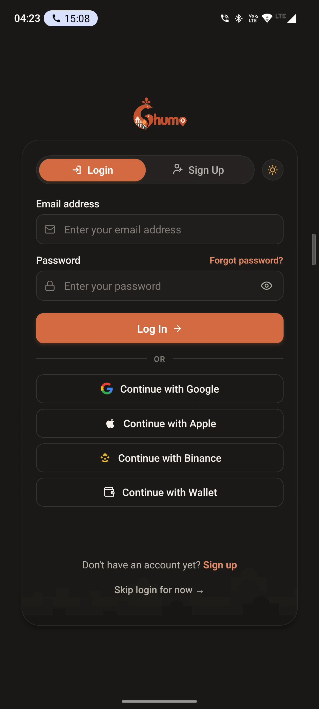
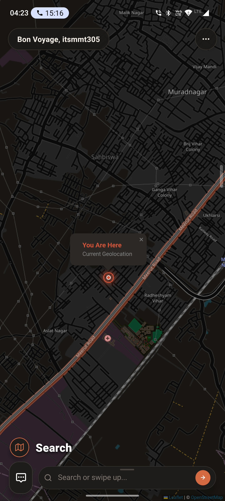
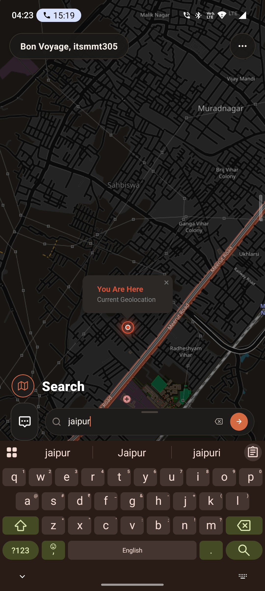
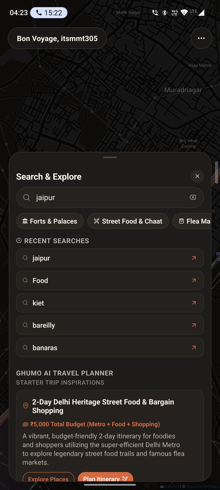
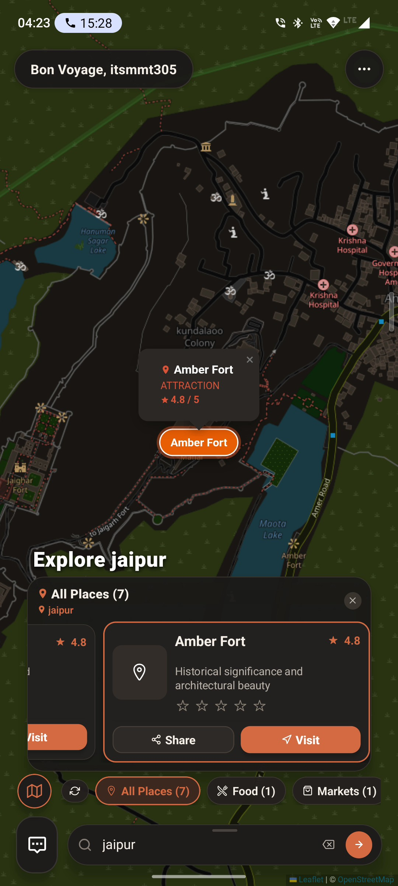
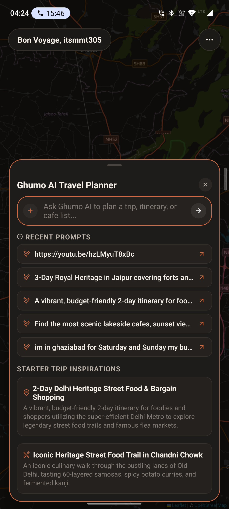
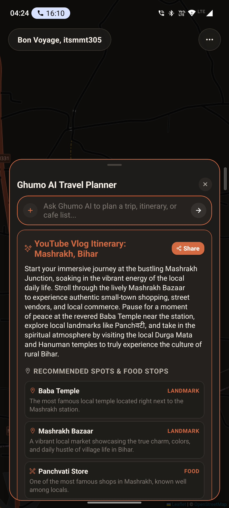
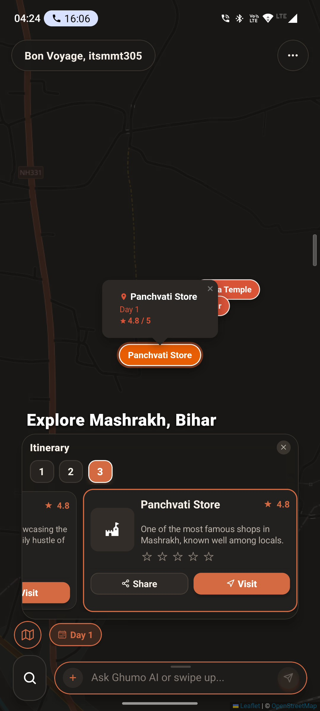

# 🧭 Ghumo — App Showcase & Feature Demos

> **Ghumo** (घूमो • *to wander / explore*) is a modern, AI-powered travel companion and hyper-local discovery platform built with Expo (React Native), Supabase, FastAPI, and OpenStreetMap. Designed with a warm terracotta visual identity, glassmorphism aesthetics, and intelligent multi-modal trip planning.

---

## 📸 Visual Showcase & Gallery

  <table>
    <tr>
      <td align="center" width="25%">
        
         
        <b>🔐 Smart Authentication</b>
      </td>
      <td align="center" width="25%">
        
         
        <b>📍 Live Map & Geolocation</b>
      </td>
      <td align="center" width="25%">
        
         
        <b>🔍 Instant Search Flow</b>
      </td>
      <td align="center" width="25%">
        
         
        <b>✨ Explore & Inspirations</b>
      </td>
    </tr>
    <tr>
      <td align="center" width="25%">
        
         
        <b>🗺️ Interactive Map POIs</b>
      </td>
      <td align="center" width="25%">
        
         
        <b>🤖 AI Planner Hub</b>
      </td>
      <td align="center" width="25%">
        
         
        <b>🎥 YouTube Video AI Itinerary</b>
      </td>
      <td align="center" width="25%">
        
         
        <b>📅 Multi-Day Day-wise Itinerary</b>
      </td>
    </tr>
  </table>

---

## 🎬 Full Demo Video

Watch the complete end-to-end walkthrough demonstrating onboarding, interactive map discovery, search exploration, and AI itinerary generation:

[Go to file](https://drive.google.com/file/d/1fdwcIu-PEz1ir1Ty-1IAjUNW75siFkqM/view?usp=drive_link) *(Local file available below)*

<video src="./samples/screen-20260912-042441.mp4" width="70%" controls="controls" poster="./samples/screen-20260912-042441_exported_7413.jpg">
  Your browser does not support the video tag. You can view the demo video directly at <a href="./samples/screen-20260912-042441.mp4"><code>./samples/screen-20260912-042441.mp4</code></a>.
</video>

> 💡 *Direct file path:* [`./samples/screen-20260912-042441.mp4`](./samples/screen-20260912-042441.mp4)

---

## 🌟 Feature Breakdown

### 1. Flexible Authentication & Multi-Provider Onboarding
Ghumo welcomes travelers with a frictionless onboarding experience. Users can authenticate using email & password, one-tap social logins (Google, Apple), Web3 & crypto providers (Binance, Web3 Wallet), or immediately explore in **Guest Mode** with zero upfront commitment. The screen also incorporates quick light/dark theme switching and dynamic branding.

  

---

### 2. Immersive Dark-Mode Map & Real-Time Geolocation
The home experience is powered by an unobstructed, full-screen OpenStreetMap engine rendered via Leaflet inside an optimized WebView. It features a custom high-contrast dark charcoal color filter, glowing real-time pulsing user location pin (`📍 You Are Here`), and floating glassmorphism search pills that never obscure navigation.

  

---

### 3. Rapid Search & Discovery Hub
Searching in Ghumo is fast and responsive with strict API discipline. Users can search for cities, landmarks, or food hotspots without aggressive background rate-limiting. A swipeable glassmorphic bottom sheet offers quick category chips (*Forts & Palaces*, *Street Food & Chaat*, *Flea Markets*), recent search history, and curated budget-tagged starter inspirations.

  
  &nbsp;&nbsp;&nbsp;&nbsp;
  

---

### 4. Interactive POI Pins & Carousel Exploration
Search results are dynamically plotted on the map with animated pins. Tapping any pin or scrolling the horizontal card carousel smoothly flies the camera to the destination, showing ratings (e.g. `★ 4.8 / 5`), rich descriptions, category tags, quick direction triggers, and one-tap social sharing.

  

---

### 5. Ghumo AI Travel Planner & YouTube Vlog Parsing
Plan full vacations and day trips effortlessly using Ghumo's AI Travel Planner. Simply type custom natural language prompts or paste any travel vlog YouTube URL (e.g. `https://youtu.be/...`). The AI engine analyzes the video or prompt, extracts key landmarks and culinary stops, and generates a structured, day-by-day travel guide.

  
  &nbsp;&nbsp;&nbsp;&nbsp;
  

---

### 6. Day-Wise Multi-Day Itineraries on Live Maps
AI-generated plans seamlessly synchronize with the interactive map. Travelers can toggle between **Day 1**, **Day 2**, and **Day 3** tabs, viewing numbered route waypoints, categorized stops (*Landmark*, *Food*, *Culture*), detailed local histories, and instant visit action links.

  

---

## 🛠️ Tech Stack & Key Highlights

- **Framework**: Expo SDK 57 (React Native, TypeScript)
- **Map Architecture**: Leaflet.js + OpenStreetMap raster tiles (Zero API key dependencies, zero watermarks)
- **Backend & AI**: FastAPI backend, Supabase Authentication & Database, Google Gemini / LLM multi-modal trip synthesis
- **Styling**: Custom Design System with Warm Ivory (`#FAF6F0`) / Dark Charcoal (`#1B1918`) palettes and Glassmorphism components
- **Navigation**: Expo Router (file-based routing)
